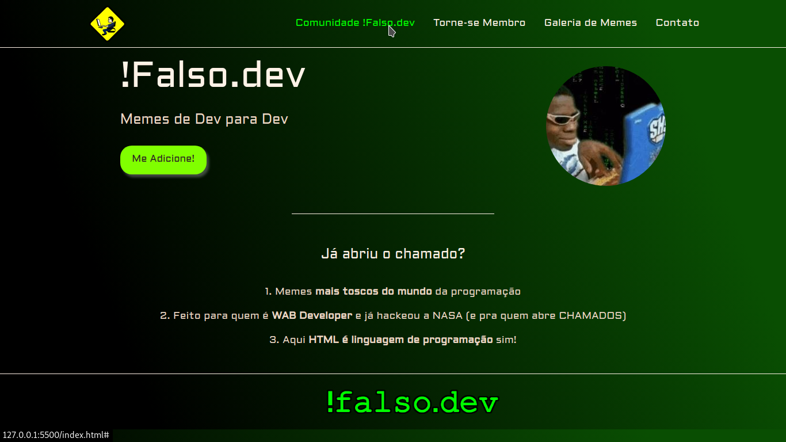

# Landing Page !Falso.dev

## Sobre o projeto 

É uma adaptação de Landing Page desenvolvida em HTML/CSS durante a live da [@rafaballerini](https://github.com/rafaballerini) no YouTube.

**Contato para Parcerias**

&nbsp;
&nbsp;
&nbsp;
&nbsp;

## Tecnologias utilizadas

&nbsp;
&nbsp;
&nbsp;
&nbsp; 